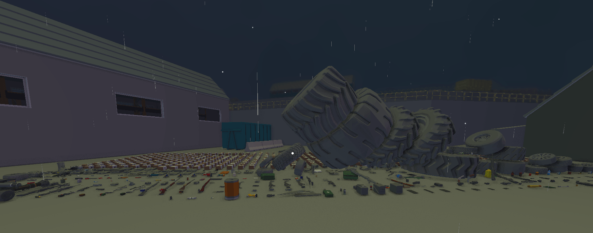
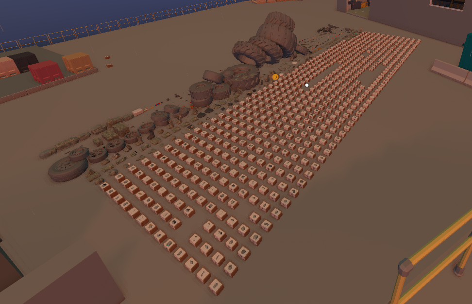

# AnyUnlocker

Unlock Anymaker vehicle items with ease. Pick items you want, download the save file, load the save & unlock your items. You'll save at least 50 hours of your precious life by doing this. **[Open AnyUnlocker](https://hakorr.github.io/AnyUnlocker/)** to get started!

## Getting Started

1. Open **[AnyUnlocker](https://hakorr.github.io/AnyUnlocker/)** & download modded save.

2. Press <kbd>WIN</kbd> + <kbd>R</kbd> on your keyboard to open the Run dialog.

3. Type `%appdata%/Anymaker/saves` and press <kbd>Enter</kbd>.

4. Extract/unzip the downloaded `creativeLootSave_unzip_me.zip` directly into that folder.

5. You should see a `creativeLootSave` folder inside the `Anymaker/saves/` directory.

6. Launch the game, load the **creativeLootSave** world, and go pick up your items!

## Philosophy

I believe it's ethical to unlock the parts that you could unlock with normal gameplay anyway, you're just saving time. I don't know why Geometa expects people have unlimited time to play their game, some really talented engineers could give great bug reports, but don't bother grinding over 50 hours to get all the parts to even begin experimenting.

I'd get if the survival aspect was more in-depth and had lots of content, they'd want people to playtest that more. But the survival sucks right now. It's just the same 30 minute gameplay loop over 100 times or more to get all the parts. It's already been tested enough, and as an engineer I personally just want to build stuff. Forcing me to play survival on creative sucks, no thanks.

## Warning

This may result in you getting banned or removed from testing, so use at your own risk. Some items might not be available via normal gameplay yet. This method shouldn't result in flying fish hitting your face.

## Some items are missing

I know this, please contribute to the code and help me! I won't promise updates, Anymaker is a work-in-progress game and might result in the save file format changing, or items being removed/added. This was developed during the alpha/beta testing phase. The full game might break AnyUnlocker.

## Legal mumbo-jumbo

AnyUnlocker is an unofficial community-made tool. It is not affiliated with, endorsed by, sponsored by, or otherwise associated with Anymaker, Geometa, or their respective owners. This tool is provided for modding, educational, and archival purposes only.

Favicon by icons8.com.

